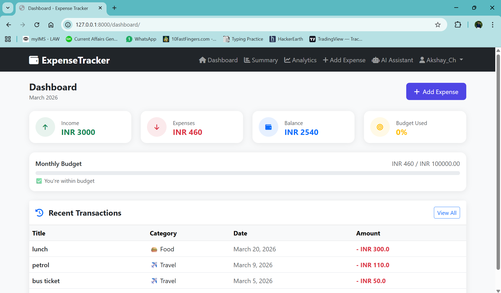
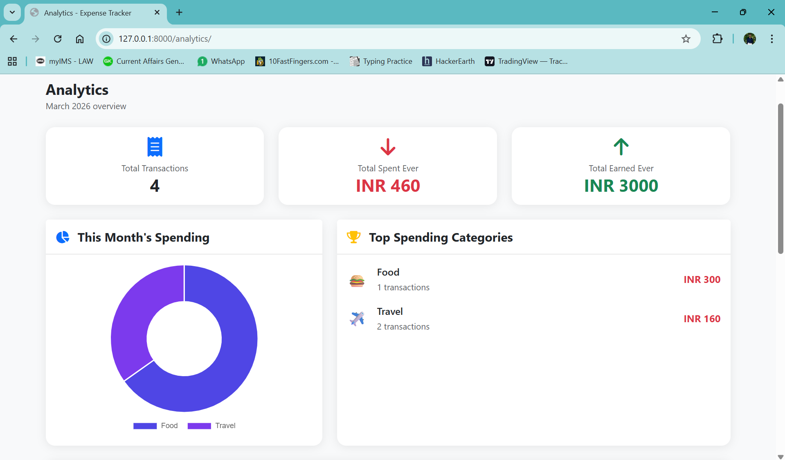

# 💰 Expense Tracker

A full-stack expense tracking web application built with 
Django, featuring AI-powered insights and a REST API.

## 🚀 Features

### Core Features
- ✅ User Authentication (Register, Login, Logout)
- ✅ Profile Management with profile picture
- ✅ Password Change & Reset
- ✅ Add, Edit, Delete Expenses & Income
- ✅ Category Management with emojis
- ✅ Filter, Search & Pagination
- ✅ Monthly Budget Tracking

### Analytics
- ✅ Interactive Dashboard
- ✅ Spending by Category (Donut Chart)
- ✅ 6 Month Trend (Bar Chart)
- ✅ Daily Spending (Line Chart)
- ✅ Income vs Expense Summary

### AI Features (Powered by Gemini AI)
- 🤖 Smart Expense Categorization
- 💡 AI Spending Insights
- 📊 Budget Recommendations
- 💬 AI Chatbot Assistant

### REST API
- ✅ JWT Authentication
- ✅ Full CRUD for Expenses
- ✅ Category Management
- ✅ Monthly Summary Endpoint
- ✅ User Registration & Login

## 🛠️ Tech Stack

| Layer | Technology |
|---|---|
| Backend | Python 3.13, Django 6.0 |
| REST API | Django REST Framework |
| Auth | JWT (SimpleJWT) |
| Frontend | HTML, CSS, Bootstrap 5 |
| Charts | Chart.js |
| AI | Google Gemini API |
| Database | SQLite (Dev), PostgreSQL (Prod) |
| Deployment | Railway/Render |

## 📸 Screenshots

### Dashboard


### Analytics


## ⚙️ Installation

### 1. Clone the repository
```bash
git clone https://github.com/YOUR_USERNAME/expense-tracker.git
cd expense-tracker
```

### 2. Create virtual environment
```bash
python -m venv venv
venv\Scripts\activate  # Windows
source venv/bin/activate  # Mac/Linux
```

### 3. Install dependencies
```bash
pip install -r requirements.txt
```

### 4. Create `.env` file
```
SECRET_KEY=your-secret-key
DEBUG=True
GEMINI_API_KEY=your-gemini-key
```

### 5. Run migrations
```bash
python manage.py migrate
```

### 6. Create superuser
```bash
python manage.py createsuperuser
```

### 7. Run server
```bash
python manage.py runserver
```

Visit 👉 `http://127.0.0.1:8000`

## 🔗 API Endpoints

### Authentication
```
POST /api/auth/register/  → Register new user
POST /api/auth/login/     → Get JWT tokens
POST /api/auth/refresh/   → Refresh access token
```

### Expenses
```
GET    /api/expenses/      → List all expenses
POST   /api/expenses/      → Create expense
GET    /api/expenses/{id}/ → Get expense
PUT    /api/expenses/{id}/ → Update expense
DELETE /api/expenses/{id}/ → Delete expense
```

### Categories
```
GET    /api/categories/      → List categories
POST   /api/categories/      → Create category
GET    /api/categories/{id}/ → Get category
PUT    /api/categories/{id}/ → Update category
DELETE /api/categories/{id}/ → Delete category
```

### Summary
```
GET /api/summary/ → Monthly summary & breakdown
```

## 👨‍💻 Author

**Akshay Chintalapati**
- GitHub: [@Akshay-Ch](https://github.com/CH-Akshay)
- Email: chintalapatiakshay@gmail.com

## 📄 License
MIT License